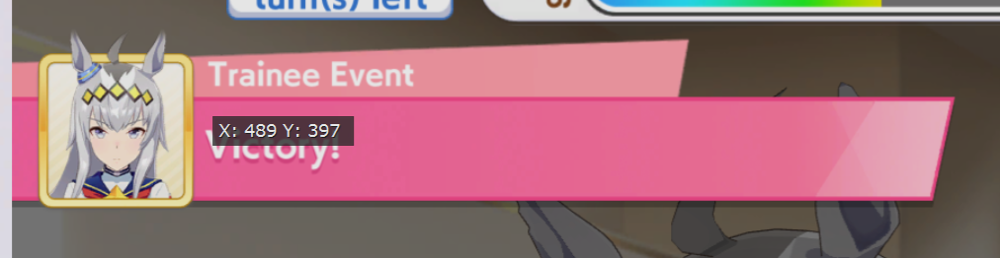
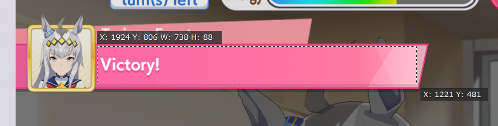

# UMA Musume Scanner Overlay Tool

A lightweight **screen overlay application** designed to assist players of the game **UMA Musume** by scanning the game screen, recognizing text choices using OCR, and displaying detailed contextual information dynamically.

---

## Features

- **Screen Region Scanning:**  
  Capture a specific user-configurable region of the screen to detect in-game choice text.

- **OCR Text Recognition:**  
  Uses Tesseract OCR to accurately extract text from screen captures in real time.

- **Fuzzy Matching:**  
  Matches detected text against a nested database of known game choices using fuzzy string matching for robust recognition even with OCR inaccuracies.

- **Dynamic Overlay:**  
  Displays matched choice information as a transparent, always-on-top overlay window with options listed.

---

## Installation & Requirements

- **Python 3.8+**  
- [Tesseract OCR for Windows](https://github.com/UB-Mannheim/tesseract/wiki) or [Tesseract OCR (Other platforms)](https://github.com/tesseract-ocr/tesseract) installed
- Python packages:  
  ```bash
  pip install pytesseract pillow pyautogui fuzzywuzzy opencv-python

## Setup

1. Configure the capture region:
    The application scans one region of the screen where UMA Musume's event details appear. This region is specified in config.json as follows:
    ```
    {
    "regions": [
        {
        "name": "Event details",
        "box": [X, Y, WIDTH, HEIGHT]
        }
    ]
    }
    ```

    Replace X, Y, WIDTH, and HEIGHT with the pixel coordinates and size of the capture box on your screen.
    If you are on a 4k display and playing Uma Musume on your primary monitor, you may not need to change these values.
    

2. How to determine the correct region coordinates:

    X and Y are coordinates relative to the top left of your monitor.
    I'm attaching how I measured the coordinates using ShareX
    
    

3. Run the scanner:
    ```
    python screencap_ocr.py
    ```

## Known Issues

Some Umas have identically named events which are not correctly identified (e.g. Dance Lesson, New Year's Resolutions, etc)
Scenario specific events do not have data
The "Select Alternative Match" button thingy doesn't work very well, it lets you select another closely matching option if the fuzzy match didn't pick the right even, but after making your selection it gets overwritten on the next loop. Usually the best match is good enough that I haven't bothered improving this functionality.